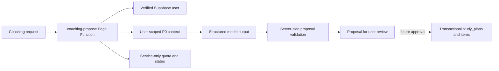

# Coaching proposal harness (DB-ver)

## Flow

This is the first plan-proposal harness, not a deployed end-to-end agent. It
returns a proposal only. It does not write `study_plans`, `study_plan_items` or
`study_sessions`, and the existing UI generation control remains disabled.

## Contract and P0 data

`POST /functions/v1/coaching-propose` requires a signed-in Supabase user JWT.
The body contains `goal_ids` (1-5 owned active goal UUIDs), `intent`
(`weekly_plan`, `daily_plan`, `exam_prep`, `topic_review`, `progress_check`),
`period_start`, `period_end` (inclusive, at most 14 days), `day_budgets`
with **one confirmed 0-480 minute entry per date**, `desired_outcome`, and
`constraints`. At least one date needs 15 available minutes. An empty calendar
is never interpreted as all-day availability.

The service-role context loader explicitly filters owned P0 rows by the
verified user ID. It reads active `learning_goals`, confirmed `goal_topics`,
active `study_methods`, scheduled `calendar_events`, recent `study_sessions`,
planned `study_plan_items`, and the user's timezone. It rejects unsupported
context sizes instead of silently dropping topics, deadlines or planned items.
Recent study is intentionally a 100-row sample. Estimated legacy completion
timestamps and estimated plan durations are represented as unknown; the
underlying activity/task remains visible to help avoid duplicate suggestions.

Only selected, bounded fields go to the model. Note bodies, Drive file content,
problem-bank uploads, OAuth credentials, raw metadata and other users' rows are
excluded. The model sees user-supplied text as data. Its strict JSON output
contains a summary and at most 30 items with goal/topic/method IDs, title,
date, minutes and reason. The validator checks every ID, confirmed topic
ownership, method, date and aggregate confirmed daily capacity. Invalid
output fails closed; it never becomes a plan.

Items are **date-only** suggestions. The harness has no confirmed clock-time
availability contract yet, so it does not claim to resolve class, work, break
or travel conflicts at a particular hour. `day_budgets` must be the learner's
confirmed incremental study capacity after such commitments.

## Quota and operations

Migration `0014_coaching_proposal_jobs.sql` adds a service-only reservation
ledger and atomic RPC: 5 attempts per user per rolling 24 hours, 100 global,
one active request per user, 10 active globally. A two-minute lease recovers
abandoned calls. The ledger retains seven days of status, item count, latency
and model/prompt/policy versions; it stores no prompt, proposal or user text. Requests that reach the
model count against the quota even if generation fails.

The function is off by default. Deployment prerequisites:

1. Apply migration 0014 to the linked Supabase project after reviewing it.
2. Set Edge Function secrets `OPENAI_API_KEY`, `COACHING_MODEL`, and
   `COACHING_HARNESS_ENABLED=true` only when ready to allow calls.
3. Deploy `coaching-propose` with JWT verification enabled.
4. Run signed-in integration checks with a fictional goal and a controlled
   budget; verify invalid IDs, quota, model refusal and over-budget output.

No key belongs in `NEXT_PUBLIC_*` or the GitHub Pages build. OpenAI's
[Structured Outputs guide](https://developers.openai.com/api/docs/guides/structured-outputs)
documents the `text.format` JSON schema path used here. The key and model are
runtime secrets, so the harness tests do not make paid model calls.

## Next increment

Add an approval RPC that atomically inserts an AI `study_plans` row and its
items using a stable idempotency key, rechecks goal/topic ownership and current
availability, and preserves revision history. Then connect the UI's request
draft to preview/review/approve and sync the approved plan to the existing
planner. Clock-time scheduling needs user-confirmed windows, conflict checks
against course schedules, calendar events and recurring commitments, and the
planner policy's breaks/travel rules. Outcome feedback and model evaluation
can then use `study_sessions` without treating generated targets as measured
performance.
