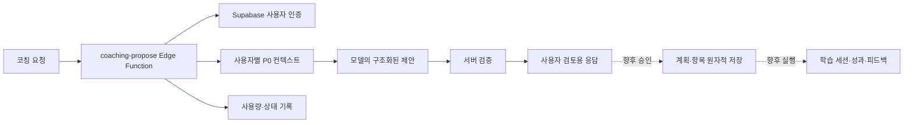

# UniLink 코칭 에이전트 하네스와 Planner Policy

이 문서는 현재 구현과 `UniLink_Planner_Policy_제약사항_검토안_v1_재정리.docx`의 정책 초안을 통합한다. **정책에 적힌 항목이 곧 구현 완료를 뜻하지 않는다.** 현재 하네스는 날짜별 예산 안에서 계획 *제안*을 반환하며, 저장·승인·실행·성과 보정은 연결되지 않았다. 정책 수치와 우선순위는 팀 검토안이다.

## 현재 흐름



- `POST /functions/v1/coaching-propose`는 로그인한 사용자의 Supabase JWT를 요구한다. 요청은 본인 소유의 활성 목표 `goal_ids` 1~5개, `intent` (`weekly_plan`, `daily_plan`, `exam_prep`, `topic_review`, `progress_check`), 최대 14일의 날짜 범위, 날짜마다 하나의 확인된 `day_budgets` (0~480분), `desired_outcome`, `constraints`를 받는다. 적어도 하루는 15분 이상이어야 한다. 빈 캘린더를 종일 가용 시간으로 간주하지 않는다.
- 컨텍스트 로더는 확인된 사용자 ID로 활성 `learning_goals`, 확정된 `goal_topics`, 활성 `study_methods`, 예정된 `calendar_events`, 최근 `study_sessions` 100건, 예정된 `study_plan_items`, 사용자 시간대를 읽는다. 크기 제한을 넘으면 조용히 누락하지 않고 실패한다. 이전 데이터의 추정 완료 시각·계획 시간은 확정 사실로 취급하지 않는다.
- 모델에는 제한된 필드만 전달한다. 노트 본문, Drive 파일 내용, 문제은행 업로드, OAuth 자격 증명, 원본 메타데이터, 다른 사용자 행은 보내지 않는다. 사용자 입력과 DB 제목은 명령이 아니라 데이터로 취급한다.
- 현재 응답은 `summary`와 최대 30개의 `items` (`goal_id`, `topic_id`, `method_code`, `title`, `planned_date`, `planned_minutes`, `reason`)다. 서버는 ID·소유권·확정 토픽·활성 방법·날짜·항목당 15~180분·날짜별 합계 예산을 검증한다. 부적합한 출력은 저장하지 않고 실패한다.
- 항목은 **날짜 단위 제안**이다. `day_budgets`는 수업·약속·이동·휴식을 고려한 추가 학습 가능 시간으로 사용자가 확인해야 한다. 현재 코드는 시간대별 슬롯, 충돌, 방법별 최소 시간, 과목 전환 횟수를 검증하지 않는다.
- 제안은 `study_plans`, `study_plan_items`, `study_sessions`에 기록되지 않는다. UI 생성 동작과 Edge Function은 기본 비활성 상태이며 실제 배포 완료로 간주하지 않는다.

## 정책 수준과 제약

| 수준 | 의미 | 적용 원칙 |
| --- | --- | --- |
| H | 실행 불가능한 계획을 막는 하드 제약 | 필요한 사실·입력 계약이 갖춰지면 서버에서 재검증 |
| S | 후보 사이에서 절충하는 소프트 목표 | 모델의 선택 근거와 평가 지표로 확인 |
| R | 관측 후 고정할 규칙 후보 | 1~2주 수정·실행 데이터로 승격 여부 결정 |
| T | 팀 합의가 필요한 기준 | 확정 전 DB `CHECK`나 불변 상수로 굳히지 않음 |

| 항목 | 목표 동작 | 현재 상태 및 필요한 작업 |
| --- | --- | --- |
| H1 실제 가용 시간·버퍼 | 학습 블록과 필수 여유가 확인된 시간 창을 넘지 않음 | 현재는 날짜별 총분만 검사. 시간 창·버퍼 계약 필요 |
| H2 고정 일정 충돌 | 수업·시험·약속·근로 시간과 중복되지 않음 | `calendar_events`는 읽지만 충돌 검증 없음. `course_schedules`, `recurring_commitments` 등 통합 필요 |
| H3 지나치게 짧은 블록 방지 | 의미 없는 쪼개기를 피함 | 항목당 15~180분 범위만 검증. 방법별 최소값 미구현 |
| H4 명시적 선택·이월 | 후보가 많으면 일부를 선택하고 나머지와 이유를 이월 | 현재는 `items`만 반환. `deferred_items` 계약 필요 |
| H5 방법-시간 적합성 | 실습·과제·프로젝트에 충분한 연속 시간 확보 | 현재는 활성 방법 코드만 검증. 연속 슬롯·방법별 기준 미구현 |
| H6 과도한 전환 제한 | 짧은 시간에 과목·방법을 자주 바꾸지 않음 | 전환 횟수·비용 지표와 기준 미구현 |
| H7 근거 없는 상태 추정 금지 | 숙련도·남은 작업량을 지어내지 않고 불확실성 표시 | 현재 모델 지시에서 허구 정보 금지. 파생 지표·신뢰도 계약 미구현 |
| H8 종료·휴식·이동·선호 존중 | 종료 시각, 휴식·이동, 선호 세션 길이 반영 | 요청에 시간 창·휴식·이동 구조가 없음. 입력·검증 필요 |

시간 창과 실제 일정 데이터가 없는 동안 H1·H2·H5·H8을 충족한다고 주장할 수 없다. 정책 프롬프트의 지시는 서버 검증을 대신하지 않는다.

## 선택·집중과 장기 커버리지

모든 목표에 시간을 균등하게 나누기보다 오늘 집중할 목표를 고른다(S). 긴급도/D-day, 중요도, 숙련도 격차, 진도, 복습 지연·첫 노출, 남은 작업량, 실제 가용성, 방법 적합성, 전환 비용, 최근 부하, 사용자 선호를 함께 고려한다. 오래 방치된 목표와 반복 이월을 다음 계획에서 재검토하고, 한 목표에 계속 쏠리는지도 살핀다. 확인되지 않은 값을 임의 점수로 채우지 않는다.

1. 후보의 소유권, 마감, 일정, 가용 시간, 정보 신뢰도를 확인한다.
2. 시간과 방법에 맞는 집중 항목을 선택한다. 의미 없는 짧은 블록과 잦은 전환을 피한다.
3. 선택하지 않은 후보에 `defer_reason`과 다음 검토 힌트를 남긴다. 장기 커버리지 손실을 점검한다.
4. 승인 직전에 서버가 최신 소유권·가용 시간·충돌·방법 제약을 재검증한다. 사용자 수정과 실제 실행을 평가에 반영한다.

정책 문서의 예시에서 과목 5개와 180분이 있어도 각 과목에 30~40분을 배분하는 대신 최적화 60분, 품질공학 60분, 오래 미룬 ML 복습 30분, SQLD 첫 노출 30분을 선택하고 나머지는 이유와 함께 이월한다. 이는 **설명용 예시**이지 확정 가중치나 항상 적용할 일정이 아니다.

### 방법별 최소 시간 가설 (T/R)

| 방법 | 검토안 |
| --- | --- |
| 개념 복습 (`concept_review`) | 30분 |
| 노트 복습 (`note_review`) | 20~30분 |
| 기본 문제 (`basic_practice`) | 45분 |
| 심화 문제 (`advanced_practice`) | 60분 |
| 오답 복습 (`wrong_answer_review`) | 30분 |
| 간격 복습 (`spaced_review`) | 20~30분 |
| 모의고사 (`mock_test`) | 실제 시험 단위 |
| 과제 (`assignment_work`) | 60분 |
| 프로젝트 (`project_work`) | 60~90분 |

이 수치는 사용자·과목·상황에 따라 조정할 **가설**이다. 현재 구현된 15~180분 검증과 혼동하지 않는다. 실제 `study_methods` 등록값과의 매핑을 확인하기 전에는 고정 enum이나 DB 제약으로 확정하지 않는다.

## 데이터 책임과 제안 출력

| 구분 | 데이터·처리 | 원칙 |
| --- | --- | --- |
| 입력 사실 | P0 목표·토픽·일정·확인된 가용 시간·학습 기록·선호 | 사용자 소유 행과 명시 입력을 구분 |
| 파생 특성 | D-day, 숙련도 격차, 진도, 복습 부채, 첫 노출, 잔여량, 최근 부하 | 사실에서만 계산. 근거 부족 시 `null`/불확실로 두고 출처·버전 추적 |
| 에이전트 결정 | 선택·이월, 방법, 계획 시간, 우선순위, 이유 | 승인 전에는 제안이며 측정 성과가 아님 |
| 실행·성과·평가 | 실제 `study_sessions`, 향후 결과·피드백·평가 지표 | 계획치와 실제치를 분리하여 보정 |

`learner_state_snapshots`, `coaching_runs`, `learning_outcomes`, `coaching_feedback` 등은 향후 저장·평가 후보이며 현재 하네스가 사용 중인 테이블이 아니다. 문제은행·Drive 자료를 사용하려면 별도 접근 권한, 추출·버전·출처·신뢰도·개인정보 필터 설계가 필요하다. 지금은 자료 내용을 모델에 전달하지 않는다.

현재의 `summary`/`items` 계약을 변경하지 않은 상태에서 다음 버전의 구조화 출력은 아래를 목표로 한다. 시간 창 계약이 준비되기 전에는 `scheduled_start`/`scheduled_end`에 임의 시각을 채우지 않고 `planned_date`와 분 단위 예산만 유지한다.

```text
selected_items[]: goal_id, topic_id, method_code, planned_date,
                  planned_minutes, priority_rank, reason
                  [시간 창 도입 후 scheduled_start, scheduled_end]
deferred_items[]: goal_id, topic_id, defer_reason,
                  reconsider_after 또는 next_review_hint
plan_summary: available_minutes, planned_minutes_total,
              focus_rationale, coverage_rationale, policy_version
```

정책 프롬프트에는 H 제약, 선택·집중과 커버리지 원칙, 좋은/나쁜 계획의 소수 예시, 선택·이월 이유를 포함한다. `policy_version`을 프롬프트·서버 검증·평가에 함께 남긴다. 현재 `COACHING_POLICY_VERSION=date-budget-v1`, `COACHING_PROMPT_VERSION=proposal-v1`은 **Planner Policy v0.1이 구현됐다는 뜻이 아니다**. 향후 `coaching_runs.output_payload` 같은 결정을 기록할 때 정책·입력·파생 특성 버전을 연결하되 민감한 원문을 불필요하게 복제하지 않는다.

## 검증과 팀 합의

회귀 시나리오는 실행 가능성(시간·충돌·휴식·이동·방법), 집중(짧은 블록·전환), 긴급도·중요도, 장기 커버리지·첫 노출, 선택·이월 설명, 불확실성, 사용자 수정·실행에 대한 적응을 측정한다. 다른 사용자 ID, 미확정 토픽, 오래된 가용 시간, 모델의 예산 초과 출력도 거절해야 한다. 1~2주 제안·수정·실행 데이터를 모아 반복적으로 유효한 정량 규칙만 서버 검증으로 승격한다. 프롬프트가 지시하는 범위와 코드가 보장하는 범위를 평가에서 분리한다.

팀에서 정할 사항은 방법별 최소 시간·예외, 전환 횟수 상한, 복습 지연 일수, 첫 노출 기한, 반복 이월 우선순위 상승, 긴급도 대 커버리지 우선순위, 남은 작업량 추정, 낮은 신뢰도에서 재질문할 기준, UI에 보여줄 이월 정보, 규칙 승격에 필요한 지표·표본 규모다. 확정 전 기본값이나 `jsonb` 데이터를 이미 합의된 정책으로 해석하지 않는다.

## 운영과 다음 구현 순서

마이그레이션 `0014_coaching_proposal_jobs.sql`은 서비스 전용 예약 원장과 원자적 RPC를 제공한다. 사용자별 이동 24시간 5회, 전체 100회, 사용자당 동시 1회, 전체 동시 10회, 2분 리스, 7일 보존이 현재 제한이다. 상태·항목 수·지연 시간·모델/프롬프트/정책 버전만 기록하며 프롬프트·제안·사용자 원문은 저장하지 않는다. 모델 호출까지 간 요청은 실패해도 할당량에 포함된다.

1. 연결된 Supabase 프로젝트에 마이그레이션 0014 적용 여부를 확인한다. `OPENAI_API_KEY`, `COACHING_MODEL`, `COACHING_HARNESS_ENABLED=true`는 호출을 허용할 준비가 됐을 때 Edge Function 비밀값으로 설정한다. JWT 검증을 켜고 `coaching-propose`를 배포한다. 키를 `NEXT_PUBLIC_*`나 GitHub Pages 빌드에 넣지 않는다.
2. 선택·이월 출력, 정책 버전, Planner Policy v0.1 프롬프트, 회귀 시나리오를 구현한다. 확인된 가용 시간, 실제 일정, 선호, 정보 신뢰도 입력을 확장한다. 시간 창을 도입하면 수업·일정·반복 약속 충돌도 검증한다.
3. 사용자 검토·수정·승인 UI와 승인 RPC를 연결한다. 승인 RPC는 멱등 키로 AI `study_plans`와 항목을 원자적으로 만들고 최신 소유권·가용성·정책 제약을 재검증하며 개정 이력을 보존한다.
4. `study_sessions`와 결과·피드백을 연결해 정책 버전별 실행 가능성과 성과를 평가한다. 생성 목표치를 실제 성과로 간주하지 않는다. 관측 후 안정적인 규칙만 승격한다.

관련 구현은 `supabase/functions/coaching-propose/index.ts`, `supabase/functions/_shared/coaching/`, `supabase/migrations/0014_coaching_proposal_jobs.sql`이다. DB 경계는 [P0 데이터베이스 설계](p0-database.md)를 함께 참조한다.
