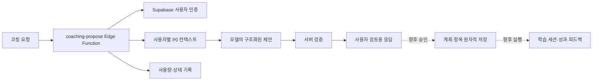

# UniLink 코칭 에이전트 하네스와 Planner Policy

이 문서는 현재 구현과 `UniLink_Planner_Policy_제약사항_검토안_v1_재정리.docx`의 정책 초안을 통합한다. **정책에 적힌 항목이 곧 구현 완료를 뜻하지 않는다.** 현재 하네스는 확인된 시간 창 안에서 계획 *제안*을 반환하며, 저장·승인·실행·성과 보정은 연결되지 않았다. 정책 수치와 우선순위는 팀 검토안이다.

## 2026-10-01 구조 검토 결론

현재 코드는 **단일 모델 호출형 제안 하네스**로서 적절한 시작점이다. 완성된 적응형 학습 에이전트는 아니다. 하네스의 역할은 인증, 컨텍스트 구성, 도구 권한, 출력 검증, 승인, 저장, 관측을 관리하는 것이며 공부 순서를 고정 알고리즘으로 대신 결정하는 것이 아니다.

아래 기존 H/S/R/T 표는 검토 이력이다. 향후 구현에서는 다음 구분을 우선한다.

- **불변 실행 경계:** 사용자 소유권, 유효한 참조, 데이터 격리, 승인 없는 쓰기 금지, 중복 적용 방지, 확정 일정 충돌 방지. 서버가 강제한다.
- **사용자 확정 제약:** 이번 요청에서 확인한 가용 시간, 종료 시각, 필수 휴식. 서버가 지키며 충족 불가 시 재질문한다. 모델이 임의로 완화하지 않는다.
- **학습 가이드:** 방법별 권장 분량, 하루 집중 목표 수, 긴급도와 장기 커버리지의 절충. 기본적으로 소프트 선호이며 예외 이유와 사용자 수정을 허용한다. 사용자가 명시적으로 고정한 경우만 해당 요청의 하드 제약으로 승격한다.
- **운영 한도:** 요청 기간, 항목 수, 호출 횟수, 토큰과 시간 한도. 교육적으로 최적이라는 의미가 아니라 비용·응답 크기 경계다.

기존 H3/H5의 최소 시간, H6의 집중 목표 수를 모든 학습자에게 보편적인 하드 규칙으로 취급하지 않는다. H7의 근거 없는 추정 금지는 유지하되 프롬프트만으로 사실성이 보장되지는 않으므로 출처와 확인 상태를 출력 계약에 추가한다. 고정 가중치로 목표 순위를 먼저 확정하고 LLM이 문장만 작성하는 구조는 채택하지 않는다.

연속 학습 상한의 누적 검사, 하루별 집중 목표 제한, 0분인 날의 빈 시간 창은 이번에 수정했다. 빈 계획/재질문 응답, 승인 저장, 정규 DB 행의 화면 조회는 다음 구축 단계다. 아래의 '검증' 표현은 현재 코드가 수행하는 검사이며 완전한 보장을 뜻하지 않는다.

목표 흐름은 `인증 → 관련 사실 조회 → 부족하면 질문 → 모델 제안 → 서버 검증 → 제한된 수정 시도 → 사용자 검토 → 최신 상태 재검증 및 원자적 승인 → 실행 기록 → 다음 요청에 피드백 반영`이다. 초기에는 단일 오케스트레이터로 충분하며 다중 에이전트, 무제한 도구 루프, 벡터 DB는 필수 조건이 아니다.

## 현재 흐름



- `POST /functions/v1/coaching-propose`는 로그인한 사용자의 Supabase JWT를 요구한다. 요청은 본인 소유의 활성 목표 `goal_ids` 1~5개, `intent` (`weekly_plan`, `daily_plan`, `exam_prep`, `topic_review`, `progress_check`), 최대 14일의 날짜 범위, 날짜마다 확인된 `day_budgets` (`date`, 0~480 `minutes`, 학습하는 날 1~8개, 0분인 날 0~8개의 `windows`), `desired_outcome`, `constraints`, `rules`를 받는다. `rules`에는 전환·휴식 분, 연속 학습 허용 분, 방법별 최소 분, 하루 집중 목표 수, 이월 여부를 설정한다. 적어도 하루는 15분 이상이어야 한다. 빈 캘린더를 종일 가용 시간으로 간주하지 않는다.
- 컨텍스트 로더는 확인된 사용자 ID로 활성 `learning_goals`, 확정된 `goal_topics`, 활성 `study_methods`, 차단 `calendar_events`, 활성 과목의 `course_schedules`, 차단 `recurring_commitments`, 기존 예약 `study_plan_items`, 최근 `study_sessions` 100건, 사용자 시간대를 읽는다. 크기 제한을 넘으면 조용히 누락하지 않고 실패한다. 이전 데이터의 추정 완료 시각·계획 시간은 확정 사실로 취급하지 않는다.
- 모델에는 제한된 필드만 전달한다. 노트 본문, Drive 파일 내용, 문제은행 업로드, OAuth 자격 증명, 원본 메타데이터, 다른 사용자 행은 보내지 않는다. 사용자 입력과 DB 제목은 명령이 아니라 데이터로 취급한다.
- 현재 응답은 `schema_version: 2`와 `summary`, 최대 30개의 `items` (`goal_id`, `topic_id`, `method_code`, `title`, `planned_date`, 현지 시각 `start_time`, `planned_minutes`, `reason`) 및 `deferred_goals` (`goal_id`, `reason`, `reconsider_on`)다. 서버는 ID·소유권·확정 토픽·활성 방법·날짜별 합계 예산·시간 창·고정 일정 충돌·전환/휴식 여유·방법별 최소 분·집중 목표 수·이월 설명을 검증한다. 부적합한 출력은 저장하지 않고 실패한다.
- 항목의 `start_time`은 사용자 시간대의 현지 시각이다. 분 단위 시간 창 안에서만 계획하며, `day_budgets.minutes`는 그날 추가로 사용할 수 있는 학습 총량이다. 수업·약속·이동·휴식을 고려한 시간 창과 여유를 사용자가 확인해야 한다. 실제 이동 경로와 이동 시간은 자동 계산하지 않는다.
- 제안은 `study_plans`, `study_plan_items`, `study_sessions`에 기록되지 않는다. 코칭 화면은 DB 목표와 `coaching-propose`를 호출하며 결과를 미리보기로 보여준다. 모델 호출은 `COACHING_HARNESS_ENABLED=true`와 `OPENAI_API_KEY`가 설정되기 전까지 비활성이다.

## 정책 수준과 제약

| 수준 | 의미 | 적용 원칙 |
| --- | --- | --- |
| H | 실행 불가능한 계획을 막는 하드 제약 | 필요한 사실·입력 계약이 갖춰지면 서버에서 재검증 |
| S | 후보 사이에서 절충하는 소프트 목표 | 모델의 선택 근거와 평가 지표로 확인 |
| R | 관측 후 고정할 규칙 후보 | 1~2주 수정·실행 데이터로 승격 여부 결정 |
| T | 팀 합의가 필요한 기준 | 확정 전 DB `CHECK`나 불변 상수로 굳히지 않음 |

| 항목 | 목표 동작 | 현재 상태 및 필요한 작업 |
| --- | --- | --- |
| H1 실제 가용 시간·버퍼 | 학습 블록과 필수 여유가 확인된 시간 창을 넘지 않음 | 시간 창·일별 분량·전환 여유 검증. 창 자체가 실제 가용성이라는 점은 사용자 확인 필요 |
| H2 고정 일정 충돌 | 수업·시험·약속·근로 시간과 중복되지 않음 | 차단 일정, 활성 수업, 반복 약속, 기존 예약 학습 항목과 충돌 검증. 누락된 외부 일정은 알 수 없음 |
| H3 지나치게 짧은 블록 방지 | 의미 없는 쪼개기를 피함 | 항목당 15~180분 및 요청의 방법별 최소값 검증 |
| H4 명시적 선택·이월 | 후보가 많으면 일부를 선택하고 나머지와 이유를 이월 | `deferred_goals`로 미선택 목표의 이유·재검토 날짜 검증. 토픽별 이월은 미구현 |
| H5 방법-시간 적합성 | 실습·과제·프로젝트에 충분한 연속 시간 확보 | 요청의 방법별 최소 연속 분량 검증. 방법별 기본 정책은 미확정 |
| H6 과도한 전환 제한 | 짧은 시간에 과목·방법을 자주 바꾸지 않음 | 목표 전환 시 최소 여유와 하루 최대 집중 목표 수 검증. 전환 횟수 상한은 미구현 |
| H7 근거 없는 상태 추정 금지 | 숙련도·남은 작업량을 지어내지 않고 불확실성 표시 | 현재 모델 지시에서 허구 정보 금지. 파생 지표·신뢰도 계약 미구현 |
| H8 종료·휴식·이동·선호 존중 | 종료 시각, 휴식·이동, 선호 세션 길이 반영 | 창 종료·연속 학습 후 휴식·일정 주변 전환 여유 검증. 실제 이동 경로·시간은 미구현 |

서버 검증은 DB에 기록된 일정과 사용자가 확인한 시간 창에 한정된다. 외부 일정이나 실제 이동 시간을 자동으로 추정하지 않는다. 정책 프롬프트의 지시는 서버 검증을 대신하지 않는다.

## 선택·집중과 장기 커버리지

모든 목표에 시간을 균등하게 나누기보다 오늘 집중할 목표를 고른다(S). 긴급도/D-day, 중요도, 숙련도 격차, 진도, 복습 지연·첫 노출, 남은 작업량, 실제 가용성, 방법 적합성, 전환 비용, 최근 부하, 사용자 선호를 함께 고려한다. 오래 방치된 목표와 반복 이월을 다음 계획에서 재검토하고, 한 목표에 계속 쏠리는지도 살핀다. 확인되지 않은 값을 임의 점수로 채우지 않는다.

1. 후보의 소유권, 마감, 일정, 가용 시간, 정보 신뢰도를 확인한다.
2. 시간과 방법에 맞는 집중 항목을 선택한다. 의미 없는 짧은 블록과 잦은 전환을 피한다.
3. 선택하지 않은 후보에 `defer_reason`과 다음 검토 힌트를 남긴다. 장기 커버리지 손실을 점검한다.
4. 승인 직전에 서버가 최신 소유권·가용 시간·충돌·방법 제약을 재검증한다. 사용자 수정과 실제 실행을 평가에 반영한다.

정책 문서의 예시에서 과목 5개와 180분이 있어도 각 과목에 30~40분을 배분하는 대신 최적화 60분, 품질공학 60분, 오래 미룬 ML 복습 30분, SQLD 첫 노출 30분을 선택하고 나머지는 이유와 함께 이월한다. 이는 **설명용 예시**이지 확정 가중치나 항상 적용할 일정이 아니다.

### 방법별 최소 시간 가설 (T/R)

| 방법 | 검토안 |
| --- | --- |
| 개념 복습 (`concept_review`) | 30분 |
| 노트 복습 (`note_review`) | 20~30분 |
| 기본 문제 (`basic_practice`) | 45분 |
| 심화 문제 (`advanced_practice`) | 60분 |
| 오답 복습 (`wrong_answer_review`) | 30분 |
| 간격 복습 (`spaced_review`) | 20~30분 |
| 모의고사 (`mock_test`) | 실제 시험 단위 |
| 과제 (`assignment_work`) | 60분 |
| 프로젝트 (`project_work`) | 60~90분 |

이 수치는 사용자·과목·상황에 따라 조정할 **가설**이다. 현재 구현된 15~180분 검증과 혼동하지 않는다. 실제 `study_methods` 등록값과의 매핑을 확인하기 전에는 고정 enum이나 DB 제약으로 확정하지 않는다.

## 데이터 책임과 제안 출력

| 구분 | 데이터·처리 | 원칙 |
| --- | --- | --- |
| 입력 사실 | P0 목표·토픽·일정·확인된 가용 시간·학습 기록·선호 | 사용자 소유 행과 명시 입력을 구분 |
| 파생 특성 | D-day, 숙련도 격차, 진도, 복습 부채, 첫 노출, 잔여량, 최근 부하 | 사실에서만 계산. 근거 부족 시 `null`/불확실로 두고 출처·버전 추적 |
| 에이전트 결정 | 선택·이월, 방법, 계획 시간, 우선순위, 이유 | 승인 전에는 제안이며 측정 성과가 아님 |
| 실행·성과·평가 | 실제 `study_sessions`, 향후 결과·피드백·평가 지표 | 계획치와 실제치를 분리하여 보정 |

`0016_coaching_runs_feedback.sql`은 영속 제안 이력과 사용자 피드백 이벤트를 위한 `coaching_runs`, `coaching_feedback`을 추가한다. `coaching-propose`는 생성 전 run을 만들고 검증된 결과 또는 제한된 오류 상태를 기록하며, 같은 요청 키와 같은 본문의 성공 요청은 저장된 결과를 반환한다. 피드백과 계획 승인은 아직 연결하지 않는다. `learner_state_snapshots`, `learning_outcomes` 등은 향후 저장·평가 후보이다. 문제은행·Drive 자료를 사용하려면 별도 접근 권한, 추출·버전·출처·신뢰도·개인정보 필터 설계가 필요하다. 지금은 자료 내용을 모델에 전달하지 않는다.

현재 출력은 `summary`, 시각이 지정된 `items`, 목표별 `deferred_goals`다. 다음 버전에서는 토픽별 이월과 더 자세한 평가 근거를 추가할 수 있다.

```text
items[]: goal_id, topic_id, method_code, planned_date, start_time,
         planned_minutes, reason
deferred_goals[]: goal_id, reason, reconsider_on
summary: string
```

현재 프롬프트는 시간 창·충돌·휴식·방법별 최소값·이월 이유를 지시하고 서버가 결과를 별도로 검증한다. `COACHING_POLICY_VERSION=time-window-v3`, `COACHING_PROMPT_VERSION=scheduled-proposal-v3`는 **Planner Policy v0.1의 모든 정량 규칙이 확정됐다는 뜻이 아니다**. 향후 `coaching_runs.output_payload` 같은 결정을 기록할 때 정책·입력·파생 특성 버전을 연결하되 민감한 원문을 불필요하게 복제하지 않는다.

## 검증과 팀 합의

회귀 시나리오는 실행 가능성(시간·충돌·휴식·이동·방법), 집중(짧은 블록·전환), 긴급도·중요도, 장기 커버리지·첫 노출, 선택·이월 설명, 불확실성, 사용자 수정·실행에 대한 적응을 측정한다. 다른 사용자 ID, 미확정 토픽, 오래된 가용 시간, 모델의 예산 초과 출력도 거절해야 한다. 1~2주 제안·수정·실행 데이터를 모아 반복적으로 유효한 정량 규칙만 서버 검증으로 승격한다. 프롬프트가 지시하는 범위와 코드가 보장하는 범위를 평가에서 분리한다.

팀에서 정할 사항은 방법별 최소 시간·예외, 전환 횟수 상한, 복습 지연 일수, 첫 노출 기한, 반복 이월 우선순위 상승, 긴급도 대 커버리지 우선순위, 남은 작업량 추정, 낮은 신뢰도에서 재질문할 기준, UI에 보여줄 이월 정보, 규칙 승격에 필요한 지표·표본 규모다. 확정 전 기본값이나 `jsonb` 데이터를 이미 합의된 정책으로 해석하지 않는다.

## 운영과 다음 구현 순서

마이그레이션 `0014_coaching_proposal_jobs.sql`은 서비스 전용 예약 원장과 원자적 RPC를 제공한다. 사용자별 이동 24시간 5회, 전체 100회, 사용자당 동시 1회, 전체 동시 10회, 2분 리스, 7일 보존이 현재 제한이다. 상태·항목 수·지연 시간·모델/프롬프트/정책 버전만 기록하며 프롬프트·제안·사용자 원문은 저장하지 않는다. 모델 호출까지 간 요청은 실패해도 할당량에 포함된다.

1. 연결된 Supabase 프로젝트에 마이그레이션 0014 적용 여부를 확인한다. `OPENAI_API_KEY`, `COACHING_MODEL`, `COACHING_HARNESS_ENABLED=true`는 호출을 허용할 준비가 됐을 때 Edge Function 비밀값으로 설정한다. JWT 검증을 켜고 `coaching-propose`를 배포한다. 키를 `NEXT_PUBLIC_*`나 GitHub Pages 빌드에 넣지 않는다. `schema_version: 2`를 사용하는 코칭 화면 배포와 함수 배포를 함께 확인한다.
2. 현재 시간 창·충돌·이월 규칙을 실제 사용자 사례로 평가한다. 이동 시간의 출처, 토픽별 이월, 선호와 정보 신뢰도를 추가하고 확정된 방법별 기준만 기본값으로 승격한다.
3. 사용자 검토·수정·승인 UI와 승인 RPC를 연결한다. 승인 RPC는 멱등 키로 AI `study_plans`와 항목을 원자적으로 만들고 최신 소유권·가용성·정책 제약을 재검증하며 개정 이력을 보존한다.
4. `study_sessions`와 결과·피드백을 연결해 정책 버전별 실행 가능성과 성과를 평가한다. 생성 목표치를 실제 성과로 간주하지 않는다. 관측 후 안정적인 규칙만 승격한다.

관련 구현은 `supabase/functions/coaching-propose/index.ts`, `supabase/functions/_shared/coaching/`, `supabase/migrations/0014_coaching_proposal_jobs.sql`이다. DB 경계는 [P0 데이터베이스 설계](p0-database.md)를 함께 참조한다.

## 하네스 구축 준비안 (2026-10-01 검토)

현재 구조는 단일 모델 호출 후 제안을 검증하는 최소 하네스다. v3 로드맵의 Topic 중심, 자료 분석과 코칭 분리, 사용자 확인, 계획과 실제 결과 구분은 유지한다. 고정 가중치 Priority Engine은 평가 기준선 후보로 둔다. 확인되지 않은 이해도나 LLM confidence를 관측 사실로 저장하지 않는다. 최초 적용 가능한 계획 서비스에는 승인과 피드백을 함께 연결한다.

### 남은 제품·시스템 과제

| 우선순위 | 문제와 근거 | 필요한 작업 |
| --- | --- | --- |
| 적용 기능 출시 전 | `p0-sync.ts`의 `belongs`와 `pullRemote`는 `legacy_bucket`이 있는 계획만 복원한다. 새 AI 계획은 저장해도 기존 화면에서 보이지 않을 수 있다. | 정규 `study_plans`/`study_plan_items` 조회 어댑터를 만들고 반환된 계획 ID로 화면을 갱신한다. AI 행에 가짜 레거시 메타데이터를 넣지 않는다. |
| 적용 기능 출시 전 | `coaching-propose`는 응답 본문을 저장하지 않고 `0014`의 운영 job은 7일 뒤 삭제된다. 승인할 제안 버전이나 수정 이력이 없다. | 영속 run과 사용자별 멱등 승인 RPC를 추가한다. |
| 제안 경험 개선 | 빈 계획은 502이며 `progress_check`도 가용 시간과 학습 항목을 요구한다. | `proposal`, `needs_input`, `no_capacity`, `progress_summary` 분기를 계약 버전과 함께 설계한다. |
| 제안 안정성 | `context.ts`의 일부 일정/기존 계획 조회는 기간 필터 전에 전체 건수 제한에 걸릴 수 있다. | 요청 기간으로 먼저 좁히고 정렬·페이지·요약을 적용한다. 실제 충돌 일정은 누락하지 않는다. |
| 개인화 | 현재 모델 입력에는 숙련도, 복습 부채, 선호와 자료 근거가 충분히 없다. | 관측 출처와 시점을 표시한 Topic 상태를 단계적으로 공급한다. |

초기 도구는 기존 로더를 감싼 목표/토픽, 일정, 최근 학습, 이전 제안 조회면 충분하다. 사용자 ID는 인증 컨텍스트에서 주입하고 조회 범위, 응답 크기, 시간과 호출 예산을 서버가 제한한다. 모델에 SQL, 임의 URL 조회, service-role 키, 범용 DB 쓰기를 주지 않는다. 자료 제목과 사용자 문장은 명령이 아닌 데이터로 다룬다.

권장 흐름은 `인증 → 관련 사실 조회 → 부족하면 질문 → 제안 → 결정적 검증 → 제한된 수정 시도 → 버전이 있는 미리보기 → 사용자 승인 → 최신 상태 재검증·원자적 저장 → 실행·피드백`이다. 인증/권한 오류를 모델 재시도로 해결하려 하지 않는다. 하드 제약을 벗어난 값을 몰래 잘라 저장하지 않고, 사용자에게 필요한 수정 사항을 보여준다. 다중 에이전트나 벡터 DB는 초기 필수 요소가 아니다.

### DB 재사용과 추가

기존 `learning_goals`, 3단계 `goal_topics`와 candidate/confirmed 상태, `study_methods`, 일정 테이블, `course_sessions`, `study_plans/items`, `study_sessions`를 재사용한다. `study_plans`에는 이미 `revision_no`, `parent_plan_id`, `approved_at`, 사용자별 `idempotency_key`가 있다. `study_sessions`의 실제 시간과 방법을 계획 분량과 분리해 활용한다.

| 시점 | 제안 변경 | 핵심 필드·관계 |
| --- | --- | --- |
| 승인형 MVP | `coaching_runs` 스키마·제안 기록 연결 완료 | `id`, `user_id`, `request_key`, intent/status, 최소 request/context snapshot, 모델·프롬프트·정책·계약 버전, 검증된 output, parent run, 오류·사용량·생성/완료/만료 시각. 한 제안 버전당 불변 1행 |
| 승인형 MVP | `study_plans.coaching_run_id` 추가 | AI 계획과 원본 run의 사용자 포함 복합 FK. 기존 수동/imported 계획은 null 허용. run 중복 적용을 막는 제약 추가 |
| 승인형 MVP | `coaching_feedback` 스키마 추가, 승인 흐름 연결 대기 | run/선택적 plan 참조, 수락·수정·거절, 설명 또는 수정 버전 참조, 시각, 중복 방지 event key |
| Topic 개인화 | `topic_observations` 신설, 상태 view 우선 | 사용자·목표·토픽, 이해도/체감 난이도/진도 등의 값과 척도, 관측/자가 보고/파생 구분, 출처, 관측·확인 시각 |
| 자료 기반 Beta | `resource_topic_links`, 분석 실행 기록 | 기존 노트/문제 자원 참조, 소유권, 파일 버전, 페이지 범위, 분석 버전, 사용자 확인 상태. 원본 파일 이중 저장 금지 |
| 문제 성과 도입 시 | 문제 시도/토픽 연결 | 실제 응답, 채점 기준 버전, 결과, 시각. 난이도 라벨을 정답률로 해석하지 않음 |

`coaching_proposal_jobs`는 7일 보존되는 quota 원장으로 유지한다. 장기 제안 이력을 여기에 종속시키지 않는다. 수정 제안은 `parent_run_id`를 가진 새 run으로 저장한다. `(user_id,request_key)`가 같고 본문이 다르면 충돌로 거절한다. 별도 `learner_state_snapshots`는 초기에는 run의 최소 snapshot으로 대체하고, `user_topic_state`는 관측값 view로 시작한다. 사용자가 확인하지 않은 모델 추정은 사실 테이블을 덮어쓰지 않는다.

### 승인 계약

`approve_coaching_proposal(run_id, expected_version, idempotency_key)`를 설계한다. 모델이 보낸 임의의 사용자 ID나 항목을 승인 입력으로 신뢰하지 않는다. 사용자가 수정하면 새 run을 검증해 저장한 뒤 그 버전을 승인한다.

1. JWT 사용자, run 소유권, 만료·취소 여부와 버전을 확인한다.
2. 같은 사용자 계획 변경을 직렬화하고 동일 키의 재전송에는 기존 plan ID를 돌려준다.
3. 목표·토픽·방법과 최신 일정·가용 시간을 다시 검사한다. 바뀐 조건은 `stale_context`로 돌려준다.
4. 날짜·현지 시각·IANA 시간대를 `timestamptz`로 변환한다. DST의 없는 시각과 중복 시각은 명시 처리한다.
5. plan/items, run 상태, 수락 feedback을 한 트랜잭션으로 기록하고 정규 plan ID로 화면을 다시 읽는다.

현재 migration `0012`는 authenticated 사용자에게 본인 계획의 직접 CRUD를 허용한다. RLS는 소유권을 보장하지만 승인이나 일정 충돌까지 강제하지 않는다. AI 승인 상태를 RPC 전용 권한 또는 트리거로 보호하고 수동 일정 수정도 같은 충돌 규약에 참여시켜야 한다. 새 테이블에는 RLS, 최소 grant, 사용자 포함 복합 FK, 계정 삭제 처리, 조회 인덱스를 함께 만든다. 기존 migration은 수정하지 않고 새 번호로 추가한다.

### 진행 순서와 검증 기준

1. 프런트 설정, Edge 배포 대상, CLI project ref, 운영 migration 이력이 같은 Supabase 프로젝트인지 확인한다. 이전 DB 이관 완료를 전제하지 않는다.
2. 제안 계약을 의도별 결과/부족 정보 분기로 개정하고 관련 기간의 컨텍스트만 조회한다. v2 클라이언트와의 버전 변환을 명시한다.
3. run/feedback/plan 연결, 승인 RPC, 정규 조회 어댑터를 함께 구현해 수동 Topic으로 승인부터 실행까지 검증한다.
4. 출처가 있는 Topic 관측을 연결한다. 자료 분석은 별도 작업으로 실행하고 후보 Topic은 사용자 확인을 거친다. Drive 내용의 모델 전달은 별도 데이터 이용 검토 후에만 켠다.
5. 승인률, 수정률, 충돌률, 실행률, 응답 지연, 반복 이월을 버전별로 평가한다. 계획 수행률을 곧 이해도 향상으로 주장하지 않는다.

검증 기준은 특정 정답 시간표의 재현이 아니라 하드 제약 위반·권한 누출·중복 적용 0건, 근거 추적, 사용자 수정 반영, 불가능한 요청의 정직한 응답이다. 회귀 테스트에는 연속 시간 경계, 일별 목표, 쉬는 날, 완전 차단일, 다른 사용자 참조, 반복 승인과 동시 일정 변경, 승인 후 새로고침, 시간대 변경을 포함한다. 로컬 테스트만으로 운영 DB나 실제 모델 배포가 확인되지는 않는다.
